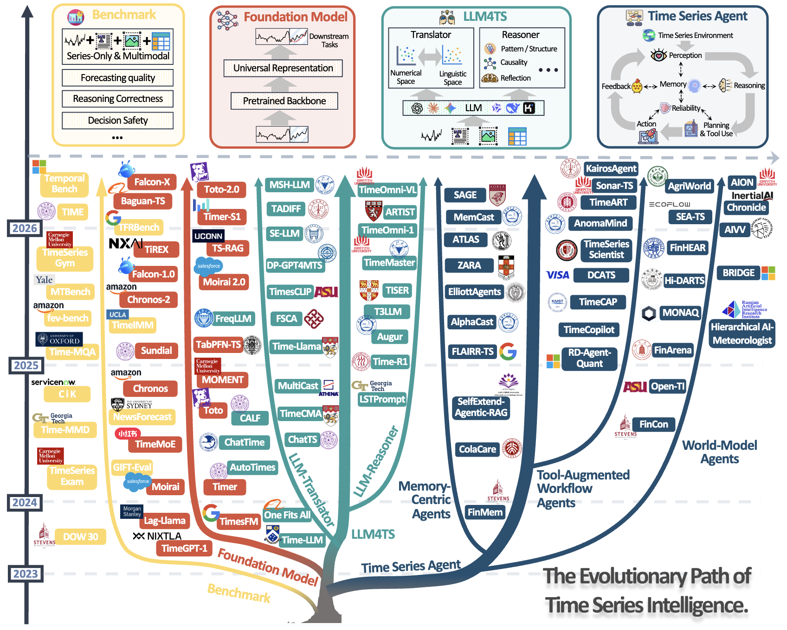
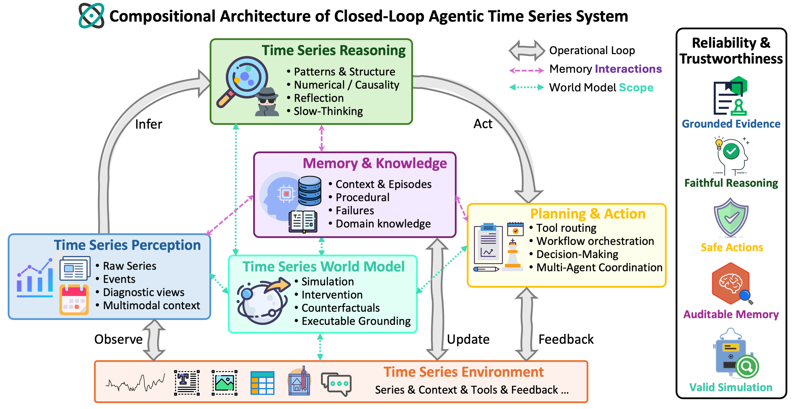

# Awesome Agentic Time Series

[](https://awesome.re)
[](https://opensource.org/licenses/MIT)[](https://github.com/TROUBADOUR000/Awesome-Agentic-Time-Series/pulls)
[](#-paper-list)

A curated list of papers on **Agentic Time Series**, covering time series foundation models, LLM4TS, temporal reasoning, benchmarks, memory, world models, reliability, and fully agentic time series systems.

## 📢 News

🚩 **2026-06**- 📄 Our [survey](The%20Landscape%20of%20Agentic%20Time%20Series%20Systems.pdf) is released! See the PDF in this repository for the paper **The Landscape of Agentic Time Series Systems: Architectures, Reliability, and Frontiers**.

🚩 **2026-06**- 📚 We create this repository to maintain a paper list on `Awesome-Agentic-Time-Series`.

🚩 Contributions are welcome. If a relevant paper is missing or misclassified, please open an issue or submit a pull request.

<div align="center">
  
  <p><em><strong>Figure:</strong> Overview of the evolutionary path of time series intelligence across four major research streams: <strong>benchmarks</strong>, <strong>foundation models</strong>, <strong>LLM4TS</strong>, and <strong>time series agents</strong>.</em></p>
</div>


## 💡Introduction

- [Paper list](#-paper-list)
  - [Surveys and Position Papers](#surveys-and-position-papers)
  - [Benchmarks and Datasets](#benchmarks-and-datasets)
  - [Time Series Foundation Models](#time-series-foundation-models)
  - [LLM4TS](#llm4ts)
  - [Agentic Time Series Systems](#agentic-time-series-systems)
- [Contributing](#contributing)
- [Citation](#citation)

<div align="center">
  
  <p><em><strong>Figure:</strong> The compositional architecture of the closed-loop agentic time series system.</em></p>
</div>

## 📚 Paper list

### Surveys and Position Papers

- [2026/05] Agentic Trading: When LLM Agents Meet Financial Markets. [[paper](https://arxiv.org/abs/2605.19337)]
- [2026/04] From Prompts to Agents: A Comprehensive Survey of LLM-Driven Time Series Analysis. [[paper](https://papers.ssrn.com/sol3/papers.cfm?abstract_id=6614598)]
- [2026/02] Position: Beyond Model-Centric Prediction—Agentic Time Series Forecasting. [[paper](https://arxiv.org/abs/2602.01776)]
- [2025/10] Towards Interpretable and Trustworthy Time Series Reasoning: A BlueSky Vision. [[paper](https://arxiv.org/abs/2510.16980)]
- [2025/09] A Survey of Reasoning and Agentic Systems in Time Series with Large Language Models. [[paper](https://arxiv.org/abs/2509.11575)]
- [2025/06] Large Language Models for Time Series Analysis: Techniques, Applications, and Challenges. [[paper](https://arxiv.org/abs/2506.11040)]
- [2025/02] Achieving Time Series Reasoning Requires Rethinking Model Design, Tasks Formulation, and Evaluation. [[paper](https://arxiv.org/abs/2502.01477)]
- [2024/02] Large Language Models for Time Series: A Survey. [[paper](https://arxiv.org/abs/2402.01801)]

### Benchmarks and Datasets

#### Forecasting and General Evaluation
- [2026/02] It's TIME: Towards the Next Generation of Time Series Forecasting Benchmarks. [[paper](https://arxiv.org/abs/2602.12147)]
- [2025/09] fev-bench: A Realistic Benchmark for Time Series Forecasting. [[paper](https://arxiv.org/abs/2509.26468)]
- [2024/10] GIFT-Eval: A Benchmark for General Time Series Forecasting Model Evaluation. [[paper](https://arxiv.org/abs/2410.10393)]
- [2023/06] ChatGPT Informed Graph Neural Network for Stock Movement Prediction. [[paper](https://arxiv.org/abs/2306.03763)]
- [2018/10] Hybrid Deep Sequential Modeling for Social Text-Driven Stock Prediction. [[paper](https://dl.acm.org/doi/10.1145/3269206.3269290)]
- [2018/07] Stock Movement Prediction from Tweets and Historical Prices. [[paper](https://aclanthology.org/P18-1183.pdf)]

#### Multimodal and Text-Paired Datasets
- [2026/03] FinTexTS: Financial Text-Paired Time-Series Dataset via Semantic-Based and Multi-Level Pairing. [[paper](https://arxiv.org/abs/2603.02702)]
- [2025/09] Fidel-TS: A High-Fidelity Multimodal Benchmark for Time Series Forecasting. [[paper](https://arxiv.org/abs/2509.24789)]
- [2025/06] Time-IMM: A Dataset and Benchmark for Irregular Multimodal Multivariate Time Series. [[paper](https://arxiv.org/abs/2506.10412)]
- [2025/06] FinMultiTime: A Four-Modal Bilingual Dataset for Financial Time-Series Analysis. [[paper](https://arxiv.org/abs/2506.05019)]
- [2025/05] MoTime: A Dataset Suite for Multimodal Time Series Forecasting. [[paper](https://arxiv.org/abs/2505.15072)]
- [2024/11] Multi-Modal Forecaster: Jointly Predicting Time Series and Textual Data. [[paper](https://arxiv.org/abs/2411.06735)]
- [2024/10] Context is Key: A Benchmark for Forecasting with Essential Textual Information. [[paper](https://arxiv.org/abs/2410.18959)]
- [2024/09] From News to Forecast: Integrating Event Analysis in LLM-Based Time Series Forecasting with Reflection. [[paper](https://arxiv.org/abs/2409.17515)]
- [2024/06] Time-MMD: Multi-Domain Multimodal Dataset for Time Series Analysis. [[paper](https://arxiv.org/abs/2406.08627)]
- [2024/06] LEMMA-RCA: A Large Multi-modal Multi-domain Dataset for Root Cause Analysis. [[paper](https://arxiv.org/abs/2406.05375)]
- [2024/02] FNSPID: A Comprehensive Financial News Dataset in Time Series. [[paper](https://arxiv.org/abs/2402.06698)]
- [2021/09] Well Googled is Half Done: Multimodal Forecasting of New Fashion Product Sales with Image-based Google Trends. [[paper](https://arxiv.org/abs/2109.09824)]

#### Reasoning, QA and Diagnostic Evaluation

- [2026/06] ODTQA-FoRe: An Open-Domain Tabular Question Answering Dataset for Future Data Forecasting and Reasoning. [[paper](https://arxiv.org/abs/2606.02433)]
- [2026/06] TimeSage-MT: A Multi-Turn Benchmark for Evaluating Agentic Time Series Reasoning. [[paper](https://arxiv.org/abs/2606.01498)]

- [2026/04] TimeSeriesExamAgent: Creating Time Series Reasoning Benchmarks at Scale. [[paper](https://arxiv.org/abs/2604.10291)]
- [2026/04] TFRBench: A Reasoning Benchmark for Evaluating Forecasting Systems. [[paper](https://arxiv.org/abs/2604.05364)]
- [2026/04] ARFBench: Benchmarking Time Series Question Answering Ability for Software Incident Response. [[paper](https://arxiv.org/abs/2604.21199)]
- [2026/03] HEARTS: Benchmarking LLM Reasoning on Health Time Series. [[paper](https://arxiv.org/abs/2603.06638)]
- [2026/02] TemporalBench: A Benchmark for Evaluating LLM-Based Agents on Contextual and Event-Informed Time Series Tasks. [[paper](https://arxiv.org/abs/2602.13272)]
- [2026/02] MMTS-BENCH: A Comprehensive Benchmark for Time Series Understanding and Reasoning. [[paper](https://arxiv.org/abs/2602.08588)]
- [2026/01] TSRBench: A Comprehensive Multi-task Multi-modal Time Series Reasoning Benchmark for Generalist Models. [[paper](https://arxiv.org/abs/2601.18744)]
- [2026/01] TSAQA: Time Series Analysis Question And Answering Benchmark. [[paper](https://arxiv.org/abs/2601.23204)]
- [2025/09] When LLM Meets Time Series: Can LLMs Perform Multistep Time Series Reasoning and Inference. [[paper](https://arxiv.org/abs/2509.01822)]
- [2025/09] CaTS-Bench: Can Language Models Describe Time Series?. [[paper](https://arxiv.org/abs/2509.20823)]
- [2025/07] TIME-RA: Towards Time Series Reasoning for Anomaly Diagnosis with LLM Feedback. [[paper](https://arxiv.org/abs/2507.15066)]
- [2025/06] ITFormer: Bridging Time Series and Natural Language for Multi-Modal QA with Large-Scale Multitask Dataset. [[paper](https://arxiv.org/abs/2506.20093)]
- [2025/03] Time-MQA: Time Series Multi-Task Question Answering with Context Enhancement. [[paper](https://arxiv.org/abs/2503.01875)]
- [2025/03] MTBench: A Multimodal Time Series Benchmark for Temporal Reasoning and Question Answering. [[paper](https://arxiv.org/abs/2503.16858)]
- [2025/02] Investigating Compositional Reasoning in Time Series Foundation Models. [[paper](https://arxiv.org/abs/2502.06037)]
- [2024/10] TimeSeriesExam: A Time Series Understanding Exam. [[paper](https://arxiv.org/abs/2410.14752)]
- [2024/10] Can LLMs Understand Time Series Anomalies?. [[paper](https://arxiv.org/abs/2410.05440)]
- [2024/04] Language Models Still Struggle to Zero-shot Reason about Time Series. [[paper](https://arxiv.org/abs/2404.11757)]
- [2024/04] Evaluating Large Language Models on Time Series Feature Understanding: A Comprehensive Taxonomy and Benchmark. [[paper](https://arxiv.org/abs/2404.16563)]
- [2020/05] ForecastQA: A Question Answering Challenge for Event Forecasting with Temporal Text Data. [[paper](https://arxiv.org/abs/2005.00792)]

#### Agentic, Engineering and Decision Evaluation
- [2026/05] Foresight Arena: An On-Chain Benchmark for Evaluating AI Forecasting Agents. [[paper](https://arxiv.org/abs/2605.00420)]
- [2026/05] Dr-CiK: A Testbed for Foresight-Driven Agents. [[paper](https://arxiv.org/abs/2605.27904)]
- [2025/07] LLM Agents Struggle at Engineering Time Series Solutions. [[paper](https://openreview.net/pdf?id=04fwpztRMB)]
- [2025/05] TimeSeriesGym: A Scalable Benchmark for (Time Series) Machine Learning Engineering Agents. [[paper](https://arxiv.org/abs/2505.13291)]

#### Event Forecasting and Future Prediction

- [2026/01] FutureX-Pro: Extending Future Prediction to High-Value Vertical Domains. [[paper](https://arxiv.org/abs/2601.12259)]
- [2025/10] LLM-as-a-Prophet: Understanding Predictive Intelligence with Prophet Arena. [[paper](https://arxiv.org/abs/2510.17638)]
- [2025/08] FutureX: An Advanced Live Benchmark for LLM Agents in Future Prediction. [[paper](https://arxiv.org/abs/2508.11987)]
- [2025/02] ForecastBench: A Dynamic Benchmark of AI Forecasting Capabilities. [[paper](https://arxiv.org/pdf/2409.19839)]
- [2024/04] AutoCast++: Enhancing World Event Prediction with Zero-shot Ranking-based Context Retrieval. [[paper](https://arxiv.org/pdf/2310.01880v2)]
- [2022/06] Forecasting Future World Events with Neural Networks (AutoCast). [[paper](https://proceedings.neurips.cc/paper_files/paper/2022/file/aec870a6772336c15dac992c16f2e7c9-Paper-Datasets_and_Benchmarks.pdf)]

### Time Series Foundation Models

- [2026/05] Falcon-X: A Time Series Foundation Model for Heterogeneous Multivariate Modeling. [[paper](https://arxiv.org/abs/2605.27286)]
- [2026/05] Toto 2.0: Time Series Forecasting Enters the Scaling Era. [[paper](https://arxiv.org/abs/2605.20119)]
- [2026/05] Time Series Causal Discovery via Context-Conditioned and Causality-Augmented Pretraining. [[paper](https://arxiv.org/abs/2605.26759)]
- [2026/05] AME-TS: Anchored Mixture-of-Experts for Time Series Forecasting. [[paper](https://arxiv.org/abs/2605.25166)]
- [2026/03] Timer-S1: A Billion-Scale Time Series Foundation Model with Serial Scaling. [[paper](https://arxiv.org/abs/2603.04791)]
- [2026/03] TimeCAP: A channel aware pre training framework for multivariate time series forecasting. [[paper](https://ore.exeter.ac.uk/ndownloader/files/60062780)]
- [2026/02] TS-Memory: Plug-and-Play Memory for Time Series Foundation Models. [[paper](https://arxiv.org/abs/2602.11550)]
- [2026/02] MEMTS: Internalizing Domain Knowledge via Parameterized Memory for Retrieval-Free Domain Adaptation of Time Series Foundation Models. [[paper](https://arxiv.org/abs/2602.13783)]
- [2025/11] Moirai 2.0: When Less Is More for Time Series Forecasting. [[paper](https://arxiv.org/abs/2511.11698)]
- [2025/10] Synthetic Series-Symbol Data Generation for Time Series Foundation Models. [[paper](https://arxiv.org/abs/2510.08445)]
- [2025/10] Chronos-2: From Univariate to Universal Forecasting. [[paper](https://arxiv.org/abs/2510.15821)]
- [2025/08] Revitalizing Canonical Pre-Alignment for Irregular Multivariate Time Series Forecasting. [[paper](https://arxiv.org/abs/2508.01971)]
- [2025/06] LightGTS: A Lightweight General Time Series Forecasting Model. [[paper](https://arxiv.org/abs/2506.06005)]
- [2025/05] TSPulse: Tiny Pre-Trained Models with Disentangled Representations for Rapid Time-Series Analysis. [[paper](https://arxiv.org/abs/2505.13033)]
- [2025/05] TiRex: Zero-Shot Forecasting Across Long and Short Horizons with Enhanced In-Context Learning. [[paper](https://arxiv.org/abs/2505.23719)]
- [2025/05] Multi-Modal View Enhanced Large Vision Models for Long-Term Time Series Forecasting. [[paper](https://arxiv.org/abs/2505.24003)]
- [2025/03] TS-RAG: Retrieval-Augmented Generation-Based Time Series Foundation Models are Stronger Zero-Shot Forecaster. [[paper](https://arxiv.org/abs/2503.07649)]
- [2025/02] Sundial: A Family of Highly Capable Time Series Foundation Models. [[paper](https://arxiv.org/abs/2502.00816)]
- [2025/02] GTM: A General Time-series Model for Enhanced Representation Learning of Time-Series Data. [[paper](https://arxiv.org/abs/2502.03264)]
- [2025/01] From Tables to Time: Extending TabPFN-v2 to Time Series Forecasting. [[paper](https://arxiv.org/abs/2501.02945)]
- [2024/09] Time-MoE: Billion-Scale Time Series Foundation Models with Mixture of Experts. [[paper](https://arxiv.org/abs/2409.16040)]
- [2024/07] Toto: Time Series Optimized Transformer for Observability. [[paper](https://arxiv.org/abs/2407.07874)]
- [2024/03] UniTS: Building a Unified Time Series Model. [[paper](https://arxiv.org/abs/2403.00131)]
- [2024/03] Chronos: Learning the Language of Time Series. [[paper](https://arxiv.org/abs/2403.07815)]
- [2024/02] Unified Training of Universal Time Series Forecasting Transformers. [[paper](https://arxiv.org/abs/2402.02592)]
- [2024/02] Timer: Generative Pre-trained Transformers Are Large Time Series Models. [[paper](https://arxiv.org/abs/2402.02368)]
- [2024/02] MOMENT: A Family of Open Time-series Foundation Models. [[paper](https://arxiv.org/abs/2402.03885)]
- [2024/01] Tiny Time Mixers (TTMs): Fast Pre-trained Models for Enhanced Zero/Few-Shot Forecasting of Multivariate Time Series. [[paper](https://arxiv.org/abs/2401.03955)]
- [2023/10] TimeGPT-1. [[paper](https://arxiv.org/abs/2310.03589)]
- [2023/10] Lag-Llama: Towards Foundation Models for Probabilistic Time Series Forecasting. [[paper](https://arxiv.org/abs/2310.08278)]
- [2023/10] A Decoder-Only Foundation Model for Time-Series Forecasting. [[paper](https://arxiv.org/abs/2310.10688)]

### LLM4TS

#### Translation and Alignment
- [2026/05] What if Tomorrow is the World Cup Final? Counterfactual Time Series Forecasting with Textual Conditions. [[paper](https://arxiv.org/abs/2605.14422)]
- [2026/05] STaT: Resolving Shape Distortion in Non-Stationary Time Series via Tri-Modal Synergy. [[paper](https://arxiv.org/abs/2605.25943)]
- [2026/05] PaP-NF: Probabilistic Long-Term Time Series Forecasting via Prefix-as-Prompt Reprogramming and Normalizing Flows. [[paper](https://arxiv.org/abs/2605.23219)]
- [2026/05] Factorize to Generalize: Retrieval-Guided Invariant-Dynamic Decomposition for Time Series Forecasting. [[paper](https://arxiv.org/abs/2605.24911)]
- [2026/02] Multi-scale hypergraph meets LLMs: Aligning large language models for time series analysis. [[paper](https://arxiv.org/abs/2602.04369)]
- [2026/01] Bridging Temporal and Textual Modalities: A Multimodal Framework for Automated Cloud Failure Root Cause Analysis. [[paper](https://arxiv.org/abs/2601.04709)]
- [2026/01] An Exploratory Study to Repurpose LLMs to a Unified Architecture for Time Series Classification. [[paper](https://arxiv.org/abs/2601.09971)]
- [2025/10] TS-Reasoner: Aligning Time Series Foundation Models with LLM Reasoning. [[paper](https://arxiv.org/abs/2510.03519)]
- [2025/10] OpenTSLM: Time-Series Language Models for Reasoning over Multivariate Medical Text- and Time-Series Data. [[paper](https://arxiv.org/abs/2510.02410)]
- [2025/09] Let LLMs Speak Embedding Languages: Generative Text Embeddings via Iterative Contrastive Refinement. [[paper](https://arxiv.org/abs/2509.24291)]
- [2025/09] AXIS: Explainable Time Series Anomaly Detection with Large Language Models. [[paper](https://arxiv.org/abs/2509.24378)]
- [2025/08] UniCast: A Unified Multimodal Prompting Framework for Time Series Forecasting. [[paper](https://arxiv.org/abs/2508.11954)]
- [2025/08] Semantic-Enhanced Time-Series Forecasting via Large Language Models. [[paper](https://arxiv.org/abs/2508.07697)]
- [2025/08] From Values to Tokens: An LLM-Driven Framework for Context-aware Time Series Forecasting via Symbolic Discretization. [[paper](https://arxiv.org/abs/2508.09191)]
- [2025/08] DP-GPT4MTS: Dual-Prompt Large Language Model for Textual-Numerical Time Series Forecasting. [[paper](https://arxiv.org/abs/2508.04239)]
- [2025/07] DualSG: A Dual-Stream Explicit Semantic-Guided Multivariate Time Series Forecasting Framework. [[paper](https://arxiv.org/abs/2507.21830)]
- [2025/06] Teaching Time Series to See and Speak: Forecasting with Aligned Visual and Textual Perspectives. [[paper](https://arxiv.org/abs/2506.24124)]
- [2025/05] Human in the Loop Adaptive Optimization for Improved Time Series Forecasting. [[paper](https://arxiv.org/abs/2505.15354)]
- [2025/03] TimeXL: Explainable Multi-modal Time Series Prediction with LLM-in-the-Loop. [[paper](https://arxiv.org/abs/2503.01013)]
- [2025/03] GEM: Empowering MLLM for Grounded ECG Understanding with Time Series and Images. [[paper](https://arxiv.org/abs/2503.06073)]
- [2025/02] Language in the Flow of Time: Time-Series-Paired Texts Weaved into a Unified Temporal Narrative. [[paper](https://arxiv.org/abs/2502.08942)]
- [2025/02] Adapting Large Language Models for Time Series Modeling via a Novel Parameter-efficient Adaptation Method. [[paper](https://arxiv.org/abs/2502.13725)]
- [2025/01] Context-Alignment: Activating and Enhancing LLM Capabilities in Time Series. [[paper](https://arxiv.org/abs/2501.03747)]
- [2025] STEM-LTS: Integrating Semantic-Temporal Dynamics in LLM-driven Time Series Analysis. [[paper](https://ojs.aaai.org/index.php/AAAI/article/view/34447)]
- [2025] FreqLLM: Frequency-Aware Large Language Models for Time Series Forecasting. [[paper](https://www.ijcai.org/proceedings/2025/377)]
- [2024/12] ChatTS: Aligning Time Series with LLMs via Synthetic Data for Enhanced Understanding and Reasoning. [[paper](https://arxiv.org/abs/2412.03104)]
- [2024/12] ChatTime: A Unified Multimodal Time Series Foundation Model Bridging Numerical and Textual Data. [[paper](https://arxiv.org/abs/2412.11376)]
- [2024/11] A Picture is Worth A Thousand Numbers: Enabling LLMs Reason about Time Series via Visualization. [[paper](https://arxiv.org/abs/2411.06018)]
- [2024/09] Towards Time Series Reasoning with LLMs. [[paper](https://arxiv.org/abs/2409.11376)]
- [2024/06] TimeCMA: Towards LLM-Empowered Multivariate Time Series Forecasting via Cross-Modality Alignment. [[paper](https://arxiv.org/abs/2406.01638)]
- [2024/05] MultiCast: Zero-Shot Multivariate Time Series Forecasting Using LLMs. [[paper](https://arxiv.org/abs/2405.14748)]
- [2024/03] CALF: Aligning LLMs for Time Series Forecasting via Cross-modal Fine-Tuning. [[paper](https://arxiv.org/abs/2403.07300)]
- [2024/03] $S^2$IP-LLM: Semantic Space Informed Prompt Learning with LLM for Time Series Forecasting. [[paper](https://arxiv.org/abs/2403.05798)]
- [2024/03] JoLT: Jointly Learned Representations of Language and Time-Series. [[paper](https://openreview.net/pdf?id=UVF1AMBj9u)]
- [2024/02] Multi-Patch Prediction: Adapting LLMs for Time Series Representation Learning. [[paper](https://arxiv.org/abs/2402.04852)]
- [2024/02] AutoTimes: Autoregressive Time Series Forecasters via Large Language Models. [[paper](https://arxiv.org/abs/2402.02370)]
- [2023/10] Time-LLM: Time Series Forecasting by Reprogramming Large Language Models. [[paper](https://arxiv.org/abs/2310.01728)]
- [2023/10] TEMPO: Prompt-based Generative Pre-trained Transformer for Time Series Forecasting. [[paper](https://arxiv.org/abs/2310.04948)]
- [2023/08] TEST: Text Prototype Aligned Embedding to Activate LLM's Ability for Time Series. [[paper](https://arxiv.org/abs/2308.08241)]
- [2023/08] LLM4TS: Two-Stage Fine-Tuning for Time-Series Forecasting with Pre-trained LLMs. [[paper](https://arxiv.org/abs/2308.08469)]
- [2023/02] One Fits All: Power General Time Series Analysis by Pretrained LM. [[paper](https://arxiv.org/abs/2302.11939)]
- [2022/10] PromptCast: A New Prompt-based Learning Paradigm for Time Series Forecasting. [[paper](https://arxiv.org/abs/2210.08964)]

#### Temporal Reasoning
- [2026/05] Reasoning-Aware Training for Time Series Forecasting. [[paper](https://arxiv.org/abs/2605.08625)]
- [2026/05] Reasoning through Verifiable Forecast Actions: Consistency-Grounded RL for Financial LLMs. [[paper](https://arxiv.org/abs/2605.21975)]
- [2026/02] TimeOmni-VL: Unified Models for Time Series Understanding and Generation. [[paper](https://arxiv.org/abs/2602.17149)]
- [2026/02] Time Series Reasoning via Process-Verifiable Thinking Data Synthesis and Scheduling for Tailored LLM Reasoning. [[paper](https://arxiv.org/abs/2602.07830)]
- [2026/02] PATRA: Pattern-Aware Alignment and Balanced Reasoning for Time Series Question Answering. [[paper](https://arxiv.org/abs/2602.23161)]
- [2026/02] Adaptive Time Series Reasoning via Segment Selection. [[paper](https://arxiv.org/abs/2602.18645)]
- [2026/01] Rationale-Grounded In-Context Learning for Time Series Reasoning with Multimodal Large Language Models. [[paper](https://arxiv.org/abs/2601.02968)]
- [2025/12] Chain-of-thought Reviewing and Correction for Time Series Question Answering. [[paper](https://arxiv.org/abs/2512.22627)]
- [2025/12] Delving into Large Language Models for Effective Time-Series Anomaly Detection. [[paper](https://openreview.net/pdf?id=6rpy7X1Of8)]
- [2025/10] Training-Free Time Series Classification via In-Context Reasoning with LLM Agents (FETA). [[paper](https://arxiv.org/abs/2510.05950)]
- [2025/10] Eliciting Chain-of-Thought Reasoning for Time Series Analysis using Reinforcement Learning. [[paper](https://arxiv.org/abs/2510.01116)]
- [2025/10] Augur: Modeling Covariate Causal Associations in Time Series via Large Language Models. [[paper](https://arxiv.org/abs/2510.07858)]
- [2025/09] Trading-R1: Financial Trading with LLM Reasoning via Reinforcement Learning. [[paper](https://arxiv.org/abs/2509.11420)]
- [2025/09] TimeOmni-1: Incentivizing Complex Reasoning with Time Series in Large Language Models. [[paper](https://arxiv.org/abs/2509.24803)]
- [2025/06] TimeMaster: Training Time-Series Multimodal LLMs to Reason via Reinforcement Learning. [[paper](https://arxiv.org/abs/2506.13705)]
- [2025/06] Time Series Forecasting as Reasoning: A Slow-Thinking Approach with Reinforced LLMs. [[paper](https://arxiv.org/abs/2506.10630)]
- [2025/05] Time-R1: Towards Comprehensive Temporal Reasoning in LLMs. [[paper](https://arxiv.org/abs/2505.13508)]
- [2025/05] Can Slow-Thinking LLMs Reason Over Time? Empirical Studies in Time Series Forecasting. [[paper](https://arxiv.org/abs/2505.24511)]
- [2025/04] Learning to Reason Over Time: Timeline Self-Reflection for Improved Temporal Reasoning in Language Models. [[paper](https://arxiv.org/abs/2504.05258)]
- [2025/02] Retrieval-augmented Large Language Models for Financial Time Series Forecasting. [[paper](https://arxiv.org/abs/2502.05878)]
- [2024/08] Can LLMs Serve as Time Series Anomaly Detectors?. [[paper](https://arxiv.org/abs/2408.03475)]
- [2024/02] LSTPrompt: Large Language Models as Zero-Shot Time Series Forecasters by Long-Short-Term Prompting. [[paper](https://arxiv.org/abs/2402.16132)]

### Agentic Time Series Systems

#### Perception Agents
- [2026/05] MarsTSC: Empowering VLMs for Few-Shot Multimodal Time Series Classification via Tailored Agentic Reasoning. [[paper](https://arxiv.org/abs/2605.09395)]
- [2026/03] Optimizing Multi-Agent Weather Captioning via Text Gradient Descent: A Training-Free Approach with Consensus-Aware Gradient Fusion. [[paper](https://arxiv.org/abs/2603.21673)]
- [2026/03] Grammar of the Wave: Towards Explainable Multivariate Time Series Event Detection via Neuro-Symbolic VLM Agents. [[paper](https://arxiv.org/abs/2603.11479)]
- [2026/03] AGCD: Agent-Guided Cross-Modal Decoding for Weather Forecasting. [[paper](https://arxiv.org/abs/2603.15260)]
- [2026/02] MAS4TS: Visual Reasoning over Time Series via Multi-Agent System. [[paper](https://arxiv.org/abs/2602.03026)]
- [2026/01] TS-Debate: Multimodal Collaborative Debate for Zero-Shot Time Series Reasoning. [[paper](https://arxiv.org/abs/2601.19151)]
- [2025/11] Hierarchical AI-Meteorologist: LLM-Agent System for Multi-Scale and Explainable Weather Forecast Reporting. [[paper](https://arxiv.org/abs/2511.23387)]
- [2025/08] ZARA: Training-Free Motion Time-Series Reasoning via Evidence-Grounded LLM Agents. [[paper](https://arxiv.org/abs/2508.04038)]
- [2025/02] TimeCAP: Learning to Contextualize, Augment, and Predict Time Series Events with Large Language Model Agents. [[paper](https://arxiv.org/abs/2502.11418)]
- [2025/02] Can Multimodal LLMs Perform Time Series Anomaly Detection?. [[paper](https://arxiv.org/abs/2502.17812)]
- [2024/10] Decoding Time Series with LLMs: A Multi-Agent Framework for Cross-Domain Annotation. [[paper](https://arxiv.org/abs/2410.17462)]
- [2024/05] CityGPT: Towards Urban IoT Learning, Analysis and Interaction with Multi-Agent System. [[paper](https://arxiv.org/abs/2405.14691)]

#### Reasoning Agents
- [2026/05] KairosAgent: Agentic Time Series Forecasting with Fused Semantic Reasoning. [[paper](https://arxiv.org/abs/2605.30002)]
- [2026/05] SAGE: Detecting Time Series Anomalies Like an Expert: A Multi-Agent LLM Framework with Specialized Analyzers. [[paper](https://arxiv.org/abs/2605.05725)]
- [2026/02] AnomaMind: Agentic Time Series Anomaly Detection with Tool-Augmented Reasoning. [[paper](https://arxiv.org/abs/2602.13807)]
- [2026/01] TimeART: Towards Agentic Time Series Reasoning via Tool-Augmentation. [[paper](https://arxiv.org/abs/2601.13653)]
- [2026/01] ChatAD: Reasoning-Enhanced Time-Series Anomaly Detection with Multi-Turn Instruction Evolution. [[paper](https://arxiv.org/abs/2601.13546)]
- [2025/12] Multi-Agent Adversarial Time Series Forecasting. [[paper](https://openreview.net/forum?id=lj1qwU6Gxs)]
- [2025/11] AlphaCast: An Interaction-Driven Agentic Reasoning Framework for Cognition-Inspired Time Series Forecasting. [[paper](https://arxiv.org/abs/2511.08947)]
- [2025/10] TS-Agent: A Time Series Reasoning Agent with Iterative Statistical Insight Gathering. [[paper](https://arxiv.org/abs/2510.07432)]
- [2025/08] CALM: Continuous, Adaptive, and LLM-Mediated Anomaly Detection in Time-Series Streams. [[paper](https://arxiv.org/abs/2508.21273)]
- [2025/06] FinHEAR: Human Expertise and Adaptive Risk-Aware Temporal Reasoning for Financial Decision-Making. [[paper](https://arxiv.org/abs/2506.09080)]
- [2025/04] Can Competition Enhance the Proficiency of Agents Powered by Large Language Models in the Realm of News-driven Time Series Forecasting?. [[paper](https://arxiv.org/abs/2504.10210)]
- [2024/10] TS-Reasoner: Domain-Oriented Time Series Inference Agents for Reasoning and Automated Analysis. [[paper](https://arxiv.org/abs/2410.04047)]

#### Planning and Action Agents
- [2026/06] GenAutoML: An Agentic Framework for Dynamic Architecture Generation and Optimization in Time-Series Analysis. [[paper](https://arxiv.org/abs/2606.05860)]
- [2026/05] Nexus: An Agentic Framework for Time Series Forecasting. [[paper](https://arxiv.org/abs/2605.14389)]
- [2026/05] AION: Next-Generation Tasks and Practical Harness for Time Series. [[paper](https://arxiv.org/abs/2605.25045)]
- [2026/03] SEA-TS: Self-Evolving Agent for Autonomous Code Generation of Time Series Forecasting Algorithms. [[paper](https://arxiv.org/abs/2603.04873)]
- [2026/02] Cast-R1: Learning Tool-Augmented Sequential Decision Policies for Time Series Forecasting. [[paper](https://arxiv.org/abs/2602.13802)]
- [2026/01] LLM-Enhanced Reinforcement Learning for Time Series Anomaly Detection. [[paper](https://arxiv.org/abs/2601.02511)]
- [2026/01] AutoLFM: A Multi-Agent LLM Framework for Automated Building Load Forecasting. [[paper](https://link.springer.com/content/pdf/10.1007/s12273-025-1385-7.pdf)]
- [2026] An Interpretable Agent-Assisted Pipeline for Statistical Anomaly Detection in IoT Temperature Time Series. [[paper](https://www.mdpi.com/2079-9292/15/9/1840)]
- [2026] MoiraiAgent: An Agentic Framework for Context-Aware Time-Series Forecasting. [[paper](https://www.salesforce.com/blog/moiraiagent/)]
- [2025/12] Conversational Time Series Foundation Models: Towards Explainable and Effective Forecasting. [[paper](https://arxiv.org/abs/2512.16022)]
- [2025/12] Many Minds, One Goal: Time Series Forecasting via Sub-task Specialization and Inter-agent Cooperation. [[paper](https://openreview.net/pdf?id=Uon41HfqR3)]
- [2025/11] TimeCIEL: Contextual Interactive Ensemble Learning for Time Series Classification. [[paper](https://hal.science/hal-05053054v1/document)]
- [2025/10] TimeSeriesScientist: A General-Purpose AI Agent for Time Series Analysis. [[paper](https://arxiv.org/abs/2510.01538)]
- [2025/09] TimeCopilot. [[paper](https://arxiv.org/abs/2509.00616)]
- [2025/08] Structured Agentic Workflows for Financial Time-Series Modeling with LLMs and Reflective Feedback. [[paper](https://arxiv.org/abs/2508.13915)]
- [2025/08] DCATS: Empowering Time Series Forecasting with LLM-Agents. [[paper](https://arxiv.org/abs/2508.04231)]
- [2025/06] MAT-AITSC: Multi-Agent Transformer-based Automated Imbalanced Time Series Classification with Hyperparameter Optimization. [[paper](https://scholar.nycu.edu.tw/en/publications/multi-agent-transformer-based-automated-imbalanced-time-series-cl/)]
- [2025/05] R&D-Agent-Quant: A Multi-Agent Framework for Data-Centric Factors and Model Joint Optimization. [[paper](https://arxiv.org/abs/2505.15155)]
- [2025/05] MONAQ: Multi-Objective Neural Architecture Querying for Time-Series Analysis on Resource-Constrained Devices. [[paper](https://arxiv.org/abs/2505.10607)]
- [2025/05] AD-AGENT: A Multi-agent Framework for End-to-end Anomaly Detection. [[paper](https://arxiv.org/abs/2505.12594)]
- [2025/01] Argos: Agentic Time-Series Anomaly Detection with Autonomous Rule Generation via LLMs. [[paper](https://arxiv.org/abs/2501.14170)]
- [2024/12] TradingAgents: Multi-Agents LLM Financial Trading Framework. [[paper](https://arxiv.org/abs/2412.20138)]
- [2024/07] FinCon: A Synthesized LLM Multi-Agent System with Conceptual Verbal Reinforcement for Enhanced Financial Decision Making. [[paper](https://arxiv.org/abs/2407.06567)]
- [2024/01] Open-TI: Open Traffic Intelligence with Augmented Language Model. [[paper](https://arxiv.org/abs/2401.00211)]
- [2024] MAS-LSTM: A Multi-Agent LSTM-Based Approach for Scalable Anomaly Detection in IIoT Networks. [[paper](https://www.scilit.com/publications/mas-lstm)]

#### Memory and Knowledge Agents
- [2026/06] MOSAIC: Modular Orchestration for Structured Agentic Intelligence and Composition. [[paper](https://arxiv.org/abs/2606.00708)]
- [2026/04] CastFlow: Learning Role-Specialized Agentic Workflows for Time Series Forecasting. [[paper](https://arxiv.org/abs/2604.27840)]
- [2026/04] An Autonomous Large Language Model-Agent Framework for Transparent and Local Time Series Forecasting. [[paper](https://advanced.onlinelibrary.wiley.com/doi/10.1002/aidi.202500236)]
- [2026/02] MemCast: Memory-Driven Time Series Forecasting with Experience-Conditioned Reasoning. [[paper](https://arxiv.org/abs/2602.03164)]
- [2025/10] ATLAS: Adaptive Trading with LLM AgentS Through Dynamic Prompt Optimization and Multi-Agent Coordination. [[paper](https://arxiv.org/abs/2510.15949)]
- [2025/08] FLAIRR-TS: Forecasting LLM-Agents with Iterative Refinement and Retrieval for Time Series. [[paper](https://arxiv.org/abs/2508.19279)]
- [2025/07] ElliottAgents: A Natural Language-Driven Multi-Agent System for Stock Market Analysis and Prediction. [[paper](https://arxiv.org/abs/2507.03435)]
- [2025/07] MERIT: Multi-Agent Collaboration for Unsupervised Time Series Representation Learning. [[paper](https://aclanthology.org/2025.findings-acl.1231.pdf)]
- [2025/06] Integrating Traditional Technical Analysis with AI: A Multi-Agent LLM-Based Approach to Stock Market Forecasting. [[paper](https://arxiv.org/abs/2506.16813)]
- [2024/11] ChatKG: Visualizing Time-Series Patterns Aided by Intelligent Agents and a Knowledge Graph. [[paper](https://www.sciencedirect.com/science/article/pii/S0097849324002279)]
- [2024/10] ColaCare: Enhancing Electronic Health Record Modeling through Large Language Model-Driven Multi-Agent Collaboration. [[paper](https://arxiv.org/abs/2410.02551)]
- [2024/05] SocioDojo: Building Lifelong Analytical Agents with Real-world Text and Time Series. [[paper](https://openreview.net/pdf?id=s9z0HzWJJp)]
- [2024/08] Agentic Retrieval-Augmented Generation for Time Series Analysis. [[paper](https://arxiv.org/abs/2408.14484)]
- [2023/11] FinMem: A Performance-Enhanced LLM Trading Agent with Layered Memory and Character Design. [[paper](https://arxiv.org/abs/2311.13743)]

#### World-Model and Data Agents
- [2026/05] Chronicle: A Multimodal Foundation Model for Joint Language and Time Series Understanding. [[paper](https://arxiv.org/abs/2605.20268)]
- [2026/05] AegisTS: A Hierarchical Agent System with Reinforcement Learning for Multivariate Time Series Data Cleaning. [[paper](https://arxiv.org/abs/2605.04902)]
- [2026/04] Time Series Augmented Generation for Financial Applications. [[paper](https://arxiv.org/abs/2604.19633)]
- [2026/04] Hubble: An LLM-Driven Agentic Framework for Safe, Diverse, and Reproducible Alpha Factor Discovery. [[paper](https://arxiv.org/abs/2604.09601)]
- [2026/04] AIVV: Neuro-Symbolic LLM Agent-Integrated Verification and Validation for Trustworthy Autonomous Systems. [[paper](https://arxiv.org/abs/2604.02478)]
- [2026/02] AgriWorld: A World Tools Protocol Framework for Verifiable Agricultural Reasoning with Code-Executing LLM Agents. [[paper](https://arxiv.org/abs/2602.15325)]
- [2026/02] Sonar-TS: Search-Then-Verify Natural Language Querying for Time Series Databases. [[paper](https://arxiv.org/abs/2602.17001)]
- [2025/10] StockAgent: A Multi-Agent Collaborative Framework for Financial Time Series Prediction. [[paper](https://ieeexplore.ieee.org/stamp/stamp.jsp?tp=&arnumber=11327922&tag=1)]
- [2025/09] Hi-DARTS: Hierarchical Dynamically Adapting Reinforcement Trading System. [[paper](https://arxiv.org/abs/2509.12048)]
- [2025/04] Multi-Agent Deep Reinforcement Learning for Integrated Demand Forecasting and Inventory Optimization in Sensor-Enabled Retail Supply Chains. [[paper](https://www.mdpi.com/1424-8220/25/8/2428)]
- [2025/03] FinArena: A Human-Agent Collaboration Framework for Financial Market Analysis and Forecasting. [[paper](https://arxiv.org/abs/2503.02692)]
- [2025/03] BRIDGE: Bootstrapping Text to Control Time-Series Generation via Multi-Agent Iterative Optimization and Diffusion Modeling. [[paper](https://arxiv.org/abs/2503.02445)]
- [2024/07] A Reflective LLM-based Agent to Guide Zero-shot Cryptocurrency Trading. [[paper](https://arxiv.org/abs/2407.09546)]
- [2024/03] A Multi-Agent Reinforcement Learning Framework for Optimizing Financial Trading Strategies based on TimesNet. [[paper](https://dl.acm.org/doi/10.1016/j.eswa.2023.121502)]
- [2024/02] A Multimodal Foundation Agent for Financial Trading: Tool-Augmented, Diversified, and Generalist. [[paper](https://arxiv.org/abs/2402.18485)]
- [2023/02] Dynamic Ensemble for Probabilistic Time-Series Forecasting via Deep Reinforcement Learning. [[paper](https://openreview.net/pdf?id=a6NvoZ5DLoe)]

### Reliability, Safety and Trustworthiness

- [2026/05] Foresight Arena: An On-Chain Benchmark for Evaluating AI Forecasting Agents. [[paper](https://arxiv.org/abs/2605.00420)]
- [2026/04] Hubble: An LLM-Driven Agentic Framework for Safe, Diverse, and Reproducible Alpha Factor Discovery. [[paper](https://arxiv.org/abs/2604.09601)]
- [2026/04] AIVV: Neuro-Symbolic LLM Agent-Integrated Verification and Validation for Trustworthy Autonomous Systems. [[paper](https://arxiv.org/abs/2604.02478)]
- [2025/12] Multi-Agent Adversarial Time Series Forecasting. [[paper](https://openreview.net/forum?id=lj1qwU6Gxs)]
- [2025/10] Towards Interpretable and Trustworthy Time Series Reasoning: A BlueSky Vision. [[paper](https://arxiv.org/abs/2510.16980)]
- [2025/06] FinHEAR: Human Expertise and Adaptive Risk-Aware Temporal Reasoning for Financial Decision-Making. [[paper](https://arxiv.org/abs/2506.09080)]
- [2025/05] MAS-LSTM: A Multi-Agent LSTM-Based Approach for Scalable Anomaly Detection in IIoT Networks. [[paper](https://www.scilit.com/publications/mas-lstm)]

## 👋 Contributing

Pull requests are welcome. Please follow the format:

- `[YYYY/MM] Full paper title. [[paper](URL)]`

If the paper has code, data, project pages, or benchmark resources, feel free to add them after the paper link.

## 📖 Citation

If you find this repository useful, please consider citing the associated survey once available.

```bibtex
@misc{tsagent_survey,
  author       = {Yifan Hu, Jie Yang, Xilin Dai, Wanxu Cai, Kuiye Ding, Yuante Li, Qinghua Liu, Enze Ma, Zhiyuan Qu, Yixin Wang, Binyan Xu, Kexin Zhang, Peiyuan Liu, Zhijian Xu, Guibin Zhang, Yujin Tang, Yanwei Yue, Kening Zheng, Chengze Li, Hanrong Zhang, Haoyan Xu, Naiqi Li, Tao Dai, Dawei Cheng, John Paparrizos, Kaize Ding, Tian Zhou, Qiang Xu, Shu-tao Xia, Shirui Pan, Philip S. Yu},
  title        = {The Landscape of Agentic Time Series Systems: Architectures, Reliability, and Frontiers},
  year         = {2026},
  howpublished = {\url{https://github.com/TROUBADOUR000/Awesome-Agentic-Time-Series}},
  note         = {GitHub repository}
}
```

## 📄 License

This repository is released under the MIT License.

## ⭐️ Star History


